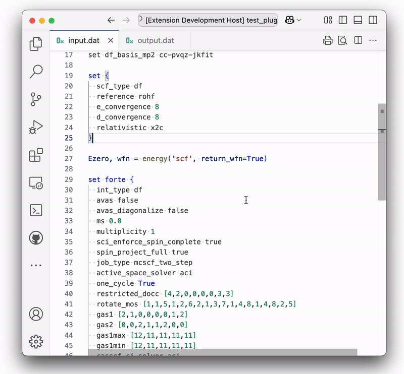
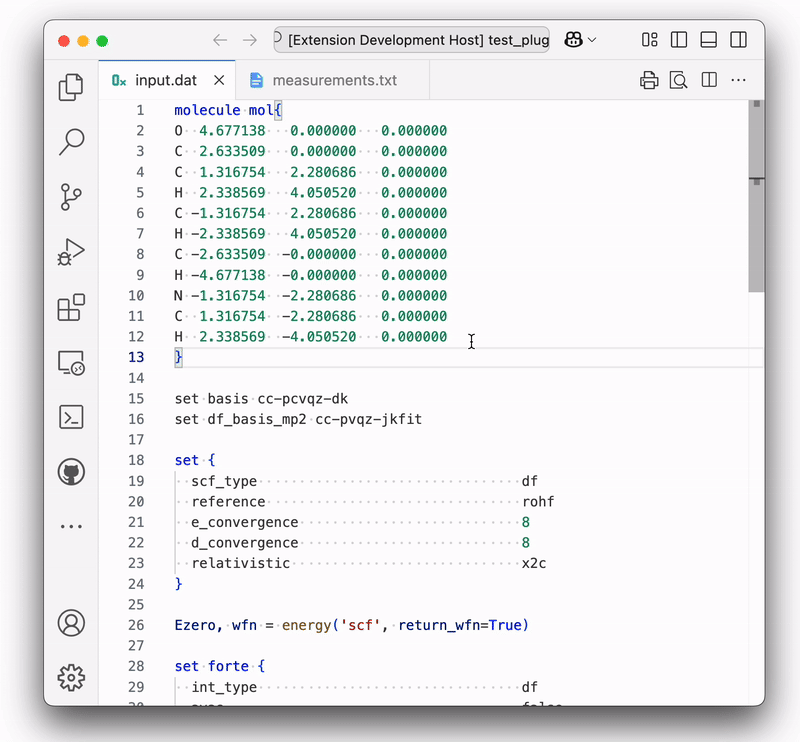
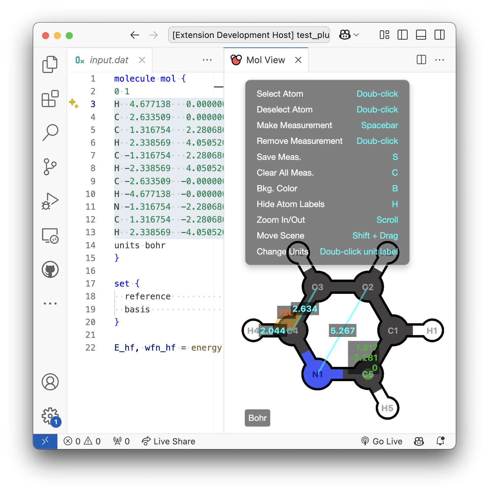
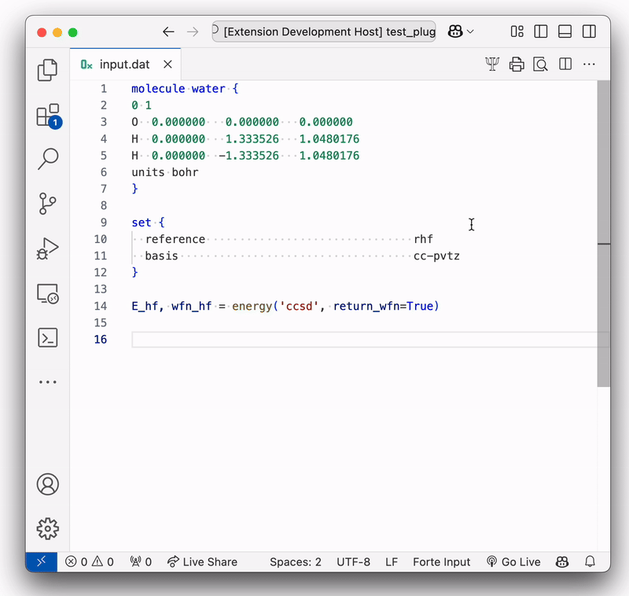

# forte-lang 

This extension offers syntax highlighting, code snippets, option auto-completion and more  for `.dat` input files used by the Forte [[1]](#1) plugin of the Psi4 [[2]](#2) quantum chemistry package.

## Features

* **Snippets**: A selection of snippets are included and can be accessed by typing `_`.

* **Language Support**: Syntax highlighting, option auto-completion and hover-over description display (both currently available only for Forte), and document reformatting.

|  |  |
|-------------------------------------|-----------------------------------|

* **Molecule Viewer**: This feature allows users to highlight any molecule in Cartesian format and plot it (`Cmd/Ctrl + M`) in a webview. Right-clicking inside the webview panel opens a helpful menu with a list of options. Measurements can be made for bond lengths, bond angles, and atomic positions. Double-clicking on the units label (lower-left corner) changes the internal plotting logic (e.g., bond cutoff, atom radii, bond radii, etc.) to better visualize molecules provided in different units (Bohr or Angstrom). *Note: This does not change the units of the molecule itself*.

|  | |
|-------------------------------------|-----------------------------------|

* **Orbital Plotter**: This feature allows users to plot orbitals (`Cmd/Ctrl + O`) from `.cube` files by selecting the directory containing the files (individual file selection is currently not supported). Orbitals are plotted as voxels (isosurface plotting is coming soon). The orbital plotting interface consists of two independent columns; selecting an orbital toggles it between the two columns.


* **Psi4 Run Button**: This feature executes a bash script located in the user’s `$HOME/Bin/` folder. To set up this feature, include a bash script named `fl_psi4_run_bash.sh` in your `$HOME/Bin/` folder with the commands you want to use to execute Psi4 when the button is pressed.
  * Example `fl_psi4_run_bash.sh` file:

  ```
  #!/bin/sh
  source activate my_conda_env
  psi4
  ```



### Version History

#### 0.0.3

* New Feature: Molecule viewer (`Cmd/Ctrl + M`)

* New Feature: Orbital plotter (`Cmd/Ctrl + O`)

* New Feature: Navigation menu button that executes the bash scrip `$HOME/Bin/fl_psi4_run_bash.sh`

* Updated: Forte options now only auto-complete within the `set forte { ... }` block

* Updated: Forte option suggestions now appear only when the option line is empty

* Updated: Hover-over Forte option suggestions now trigger only within the `set forte { ... }` block

* Updated: Reduced spacing between options and values when auto-reformatting the document

* Fixed: Comments no longer get auto-formatted

* Fixed: Highlighting for missing irreps

#### 0.0.2

* Added auto-completion and hover-over for Forte options
* Added reformatting for `set { ... }` and `set forte { ... }` option blocks
* Improvements to snippets and highlighting

#### 0.0.1

Initial release of forte-lang

## References

<a id="1"> [1] </a> F. A. Evangelista, C. Li, P. Verma, K. P. Hannon, J. B. Schriber, T. Zhang, C. Cai, S. Wang, N. He, N. H. Stair, et al., *arXiv preprint arXiv:2405.10197* (**2024**)
[[docs]](https://forte.readthedocs.io/en/latest/)

<a id="2"> [2] </a> D. G. Smith, L. A. Burns, A. C. Simmonett, R. M. Parrish, M. C. Schieber, R. Galvelis, P. Kraus, H. Kruse, R. Di Remigio, A. Alenaizan, A. M. James, S. Lehtola, J. P. Misiewicz, M. Scheurer, R. A. Shaw, J. B. Schriber, Y. Xie, Z. L. Glick, D. A. Sirianni, J. S. O’Brien, J. M. Waldrop, A. Kumar, E. G. Hohenstein, B. P. Pritchard, B. R. Brooks, H. F. Schaefer, A. Y. Sokolov, K. Patkowski, A. E. Deprince, U. Bozkaya, R. A. King, F. A. Evangelista, J. M. Turney, T. D. Crawford, and C. D. Sherrill, *J. Chem. Phys.* 152, 184108 (**2020**)
[[docs]](https://psicode.org/psi4manual/master/index.html)
